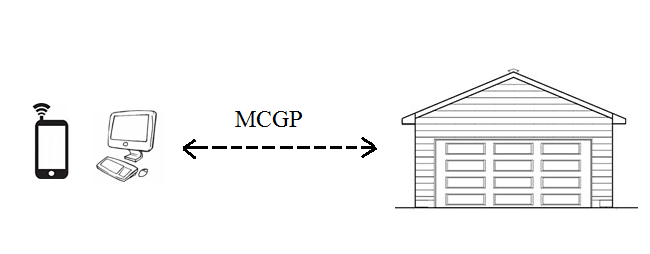
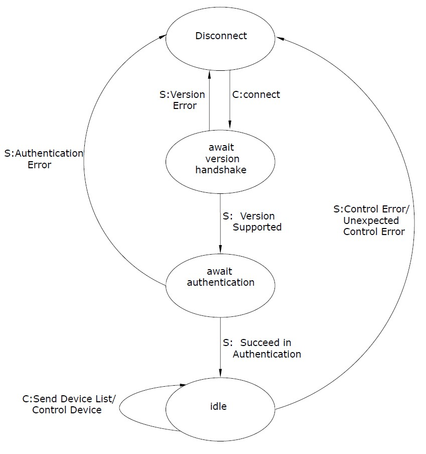

1. Service Description
=======

The Monitor and Control Garage Protocol (MCGP) provides a mechanism for users
to manage, monitor and control a garage through the services defined by the
protocol. MCGP provides a communication specification for applications, and is
a protocol defined at the application layer utilizing TCP/IP. MCGP uses TCP as
its transport layer protocol in order to have a reliable, secure and ordered
connection.

The protocol works in a client-server mode and provides authentication and
encryption using TLS. After the client passes the server’s authentication,
users can have a remote connection with their garage. Applications that follow
MCGP will provide two services to users: 

1. The monitor service, server may connect to many digital devices in the
garage such as thermometer, barometer and hygrometer. This allows a user
to watch various environment parameters through the client.
    
2. The control service, in which a user can remotely control the door of
the garage or the light inside it through client. Figure 1 is the schematic
diagram of the MCGP.




2. Message Definition – PDU
=======

# 2.1 Addressing

The protocol is designed to operate over any reliably ordered transport layers.
It is recommended that TCP/IP be used for the implementation. The client will
establish a connection with a server using its IP address and a designated port
number. In order to allow multiple connections to the server port numbers will
used to allow different devices to be connected at any given time. An unused
port of 6666 was selected because it does not require registration as is
currently not being used by any other services at this time.

# 2.2 Flow Control

Flow control is handled at the TCP/IP Layer.

# 2.3 PDU schema

```
   0                   1                   2                   3
   0 1 2 3 4 5 6 7 8 9 0 1 2 3 4 5 6 7 8 9 0 1 2 3 4 5 6 7 8 9 0 1
   +-+-+-+-+-+-+-+-+-+-+-+-+-+-+-+-+-+-+-+-+-+-+-+-+-+-+-+-+-+-+-+-+
   |  version (1)  |     op (1)    |   errno (1)   | /reserved/ (1)|
   +---------------+---------------+---------------+---------------+
   |       ident (authentication identifier) (8 bytes)             |
   |                                                               |
   +---------------+---------------+---------------+---------------+
   | dev_id[0] (1) |dev_type[0] (1)| dev_status[0] | dev_action[0] |
   +---------------+---------------+---------------+---------------+
   |                        dev_value (4)                          |
   +---------------+---------------+---------------+---------------+
   | dev_id[1] (1) |  dev_type (1) | dev_status[1] | dev_action[1] |
   +---------------+---------------+---------------+---------------+
   |                        dev_value (4)                          |
   +---------------+---------------+---------------+---------------+
   | dev_id[2] (1) |  dev_type (1) | dev_status[2] | dev_action[2] |
   +---------------+---------------+---------------+---------------+
   |                        dev_value (4)                          | 
   +---------------+---------------+---------------+---------------+
   | dev_id[3] (1) |  dev_type (1) | dev_status[3] | dev_action[3] |
   +---------------+---------------+---------------+---------------+
   |                        dev_value (4)                          | 
   +---------------+---------------+---------------+---------------+
   | dev_id[4] (1) |  dev_type (1) | dev_status[4] | dev_action[4] |
   +---------------+---------------+---------------+---------------+
   |                        dev_value (4)                          |
   +---------------------------------------------------------------+

                  Figure 2:  Format of a MGCP message
```

Field descriptions:

* version (1 byte) unsigned integer is now 0x01 (MUST be set on every packet)
* op (1 byte) unsigned integer according to Table 1
* errno (1 byte) unsigned integer according to Table 2
* ident (4 bytes) UTF-8 encoded string
* dev_id (1 byte) unsigned integer (device unique identifier on the server)
  dev_id MUST NOT be zero (reserved for empty)
* dev_type (1 byte) unsigned integer according to Table 3
* dev_status (1 byte) unsigned integer according to Table 3
* dev_action (1 byte) unsigned integer according to Table 3
* dev_value is a 32 bit (4 bytes) floating point number

All messages are an ordered byte stream with a fixed size with values coded
in big-endian format.

Unused (unapplicable) fields SHOULD be set to their zero value and MUST be
discarded by recipient.

```
Op Code             Message Type
0x00				/Reserved/
0x01				Version Check
0x02				Authentication
0x03				List Devices / List complete
0x04				List Devices / Continued
0x05				Control with Action

Table 1 Message Codes
```

```
Error Byte		Error Reason
0x00			NO ERROR
0x01			Version not available
0x02			Authentication Error
0x03            List Devices Error
0x04            Control error
0x05            Unexpected operation

Table 2: Error Bytes
```

```
------------------------- Initial Device Types --------------------------------

Device Code Device Type			States                   Available Actions
0x00   ->   /empty/
0x01   ->   Garage Door		   open(0x00)/closed(0x01)  open(0x01)/close(0x00)
0x02   ->   Light              on(0x01)/off(0x00)       turn on(0x01)/off(0x00)
0x03   ->   Temp Sensor 	   on(0x01)/off(0x00)       (no actions)
0x04   ->   BaroPres Sensor    on(0x01)/off(0x00)       (no actions)

Table 3: List of supported devices
```

At any time if an error is received the error message and error byte will be
sent by either the client or server.

# 2.4 Communication protocol

The protocol flow is as follows:

0) Connect with TLS Handshake
1) Handshake – Client sends the protocol version
2) Authentication - Client sends the identity it wants to use
2) Listing - Client sends a query to list all devices and states
3) Control - Client sends <device_id, action_id> tuple
4) Disconnect

All fields that are unused should be set to zero.

## 2.4.1 Handshake

Client sends to server a single packet:
* version=X
* op=0x01 (version check)

Successful server response:
* version=X
* op=0x01 (version check)
* errno=0x00 (no error)

Erronous server response:
* version=X
* op=0x02 (version check)
* errno=0x01 (version not available)

## 2.4.2 Authentication

Client sends to server a single packet:
* version=X
* op=0x02 (authentication)
* ident=Y

Successful server response:
* version=X
* op=0x02 (authentication)
* errno=0x00 (no error)

Erronous server response:
* version=X
* op=0x02 (authentication)
* errno=0x02 (authentication error)

## 2.4.3 Listing

Client sends to server a single packet:
* version=X
* op=0x03 (list devices)

Successful server response (there are more than five):
* version=X
* op=0x04 (list devices / continued)
* errno=0x00 (no error)
* server sets dev_id, dev_type, dev_status as appropriate
* server MUST send next packet

Successful server response (this is the last 5):
* version=X
* op=0x03 (list devices / complete)
* errno=0x00 (no error)
* server sets dev_id, dev_type, dev_status as appropriate
* no more packets in this listing from server

Erronous server response:
* version=X
* op=0x03 (list devices)
* errno=0x03 (list devices error)

## 2.4.4 Control

Client sends to server a single packet:
* version=X
* op=0x05 (control with action)
* device_id=Y, device_action=Z (up to 5 pairs)

Successful server response:
* version=X
* op=0x05 (control with action)
* errno=0x00 (no error)

Erronous server response:
* version=X
* op=0x05 (control with action)
* errno=0x04 (control error)

# 2.5 Quality of Service / Error Control 

The are several different types of error control as mentioned above. When
an error occurs the error message and error code are sent. The connection is
then terminated and everyone goes back to the IDLE state. The client must then
reinitiate the connection with a Request Connection as described above.  

The protocol is simplistic to use but still allows for authentication with
the server. It provides a simple method to control and read the status of
various devices. This is an advantage when most devices will be small resource
constrained devices. Having a protocol that is simple to implement but still
provides control and security is important in an ever connected world.


3. DFA
=======  
Figure3.1 is the new DFA of the MCGP protocol. It has 4 states, after the connection between client and server successfully been set  
up.The server will check whether the client's version is supported or not. If not, the connection will be closed. If the version is  
supported by the server, it will send back an response and move to the await authentication state. In the authentication state, the  
server will check whether or not the identifier sent by the client matches its own. If not, the connection will be closed. If succeed,  
the server will move to idle state. In idle state, the server will keep on listening request sent by the client. It supposed to deal with  two kinds of operation, list and control. When the server receives list command,it will send the statuses of all the devices in the  
garage back to the client and wait for the next command. When the server receives a control command, it will change the status of a  
device depends on the command. Any kinds of errors happened in the idle state will disconnect the connection.  

  

                                                  Figure3.1

4. Extensibility
=======

MCGP is build to be an extensible application level protocol. The first reason
is that it is meant to run on top of existing protocols like TCP. Since TCP
itself is built to be extensible, we inherit that benefit. 

In addition to extensibility with sublayers, there is also the ability to
extend on an application layer. We could implement a version to be more
specific that would be built on top of MCGP. It could validate certain types
of devices by massages in the payload. 

We could also build on top to add additional device types with new device codes
 to the pdu in future versions. 

Additional protocols also extend this one and define custom messages and build
a more specific message spec that certain devices and server applications could
honor, for instance say Company X builds garage doors and other automated
devices, they could define a protocol XMCGP which has specific messages that X
devices and X Server implementation understand. This MCGP serves as a building
block for future home automation product protocols.


5. Security
=======

# 5.1 Security model

The MCGP protocol's security model relies on SSL/TLS with client certificate
authentication. The use of SSL/TLS over the TCP connection established by MGCP
ensures confidentiality and authenticity, as well as protects against replay
attacks (as does TLS).

# 5.2 Authentication method

The MGCP server only accepts connections from clients that present a client
certificate during TLS handshake that is signed by the Certificate Authority
that the server knows and explicitly allows. The server is then able to make
access-decisions based on the Common Name (CN) of the client certificate.

The client is given an option to authenticate in the protocol handshake
(not TLS handshake). This authentication phase usually repeats the identifier
from Common Name and the server MAY require them to match. However, the server
MAY allow certain certificate holders (identified by CN) to impersonate
other users. This authentication field allows for this possibility without
the need to create extra certificates.

An example scenario would include a special-purpose certificate with CN such
as `admin` that would allow the user of this certificate to provide any
identity to the server and have it accepted. The protocol definition is
flexible in the implementation of the meaning of these authentication fields
and can be made very powerful. A minimum reference implementation SHALL check
that the CN of the certificate matches the `ident` field in the authentication
phase.

# 5.3 Solved security challenges

* Server spoofing / MITM attacks - the use of TLS provides sufficient
  resiliency against MITM attacks.
* Packet tampering - the use of TLS provides sufficient protection against any
  message tampering.
